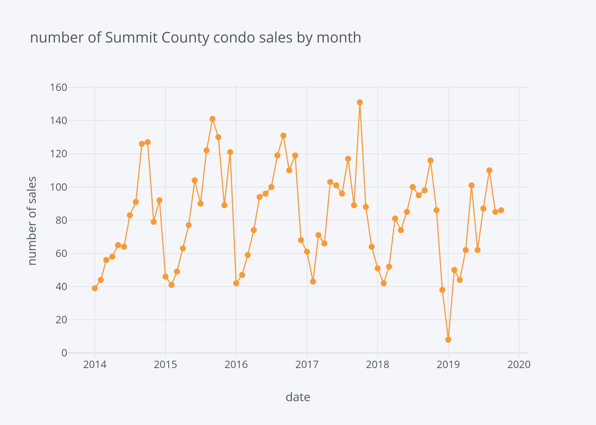
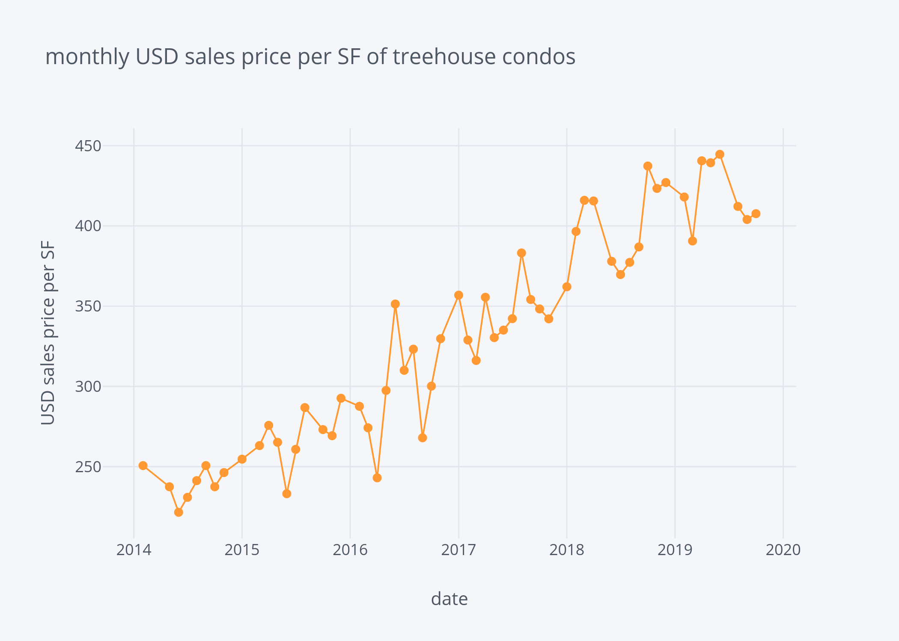

# Summit County Real Estate Analysis
After buying and partially living (summers and weekends) in a condo in the mountains (Summit County near Keystone and many other ski resorts) for a few years, I decided it was time to sell.  From watching the market for a few years, I had noticed prices seemed to dip at the end of the summer, and be higher in the winter ski season.  I wondered if there were any significant differences between selling in December/January or waiting a month of two (e.g. could I get an extra few percent by waiting a month to sell?), and analyzed past sales data to answer this question.

The conclusion is that price does not seem to have any significant monthly trend, but has been in a strong uptrend for several years and seems to match the general stock market.  The more important factor for when to buy and sell is the supply of housing.  Supply is at a minimum around January each year, and a maximum in late summer.  Consequently, it's best to sell around January and buy around August if possible, as this will maximize your leverage in negotiations.

## Data Source
Fortunately, Summit County makes [recent sales data public](http://www.co.summit.co.us/389/Sales-Reports).  I manually downloaded all the excel files since there aren't that many.  The data for each property in Summit County is also publicly available [here](http://gis.summitcountyco.gov/Map/), although some web scraping would need to be done to collect it all.  For example, [here's a treehouse condo unit](http://gis.summitcountyco.gov/Map/DetailData.aspx?Schno=601192).

## Results
First, one reason I believed prices might be higher in the winter is due to low supply.  I had seen this in realtors' newsletters, and here is the raw data:

As we can see, the number of sales is much lower in the winter months than summer.  Obviously, lower supply is good for the seller and gives sellers better negotiation leverage.  If you are buying, late summer and early fall look to be the times with the most supply and should give buyers the best leverage in negotiations.

Looking at the price data, we can see there is no clear monthly trend in price.  There is a strong uptrend in price, which is to be expected in a strong economy where stocks are going up and those who have benefited from stock prices can purchase luxury housing such as ski condos.  From my experience, most of the condo owners in Summit county seem to be older and wealthier individuals and not locals.  The demand for housing in mountain towns seems to be fueled by wealthier individuals who have extra money from stocks and high-paying jobs in large cities, and not those who live and work in the mountains.

The trend seems to be flattening out during 2019, but also flattened out in 2015/2016 when the stock market had a weak spell.  Judging by this plot and the price of SPY (an S&P500 index mutual fund), it looks like housing prices are highly correlated with the general stock market.  In 2018, it looks like there was a dip in prices, which was the year I started paying close attention to prices.  This explains my belief (which I have since revised) that prices are usually lower at the end of the summer.  Part of this price dip was probably due to stock market turmoil in 2018 from Trump's trade wars.  Prices may not be lower, but supply is much higher near the end of summer, so it's still likely the best time to buy property in Summit County.

Looking specifically at the condo complex where I own(ed) a unit (the Treehouse Condominiums), we can see the average price per square foot is almost the same as the Summit County trend:

Even more specifically, we can see the top-floor 1000-square-foot units (like the one I had) follow the trend as well.

Since there are so few sales of these units, this data is difficult to use to summarize trends.  The sales prices of these units in part depends on how well the unit is marketed and negotiated, as well as the seller's specific situation.  The condition of the units also varies widely, and can effect price significantly. For example, the $425K sale in 2019 was an extensively-remodeled unit with new hardwood floors, which was probably also expertly marketed and negotiated.  The other lower sales were not as nice of units and the sellers may have needed money quickly.

# Conclusion
In conclusion, it appears there is no specific advantage to selling at any particular time of year for top-floor 1000-sq-ft Treehouse condo units.  However, condo supply in Summit County is lowest around December through March, which coincides with the peak ski season.  This is not surprising, as no one wants to sell a ski condo during the season.  However, basic supply and demand economics principles dictates that the best time to sell is in the peak ski season and the best time to buy is during the late part of summer or early fall.  Prices do not seem to reflect this expectation, but perhaps other metrics such as days on market and number of offers do.

Further research into this topic could include modeling the data with fbprohpet to extract trends (e.g. long-term trends and monthly trends), as well as looking at other data not available from the public dataset such as days on market and the pictures and text from MLS listings.  A few other factors missing from this analysis are the number of bathrooms and bedrooms and the quality of the interior of the property.
